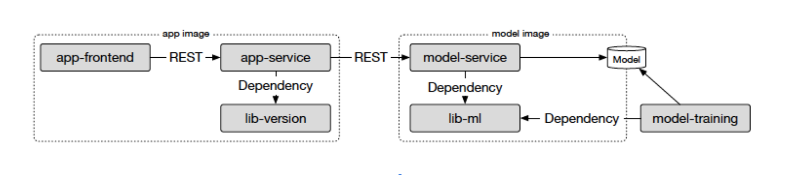

## Deployment Documentation

This document provides a detailed overview of the deployment structure and data flow for the Restaurant Sentiment Analysis system on a Kubernetes cluster using Istio as the service mesh. It is designed to make the resource relationships, traffic routing decisions, and system architecture clear and accessible for team members.

---

### 1. Deployment Structure

The system consists of several deployed components, each serving a specific function:

#### Core Components

* **App Image**

  * **[app-frontend](https://github.com/remla25-team7/app)**: A simple frontend web interface exposed externally via Istio Gateway.
  
  * **[app-service](https://github.com/remla25-team7/app)**: A Flask-based service that receives requests from the frontend and communicates with the model-service. It uses [`lib-version`](https://github.com/remla25-team7/lib-version) to expose version metadata.

* **Model Image**

  * **[model-service](https://github.com/remla25-team7/model-service)**: A Flask REST API that loads a trained sentiment model and exposes prediction functionality. It depends on [`lib-ml`](https://github.com/remla25-team7/lib-ml) for preprocessing and model utilities.

* **Model Training**

  * **[model-training](https://github.com/remla25-team7/model-training)**: A separate training pipeline that produces the model consumed by the `model-service`. This is not deployed to Kubernetes but runs during the **GitHub Actions CI pipeline**.

* **Deployment & Operations**

  * **[operation](https://github.com/remla25-team7/operation)**: Coordinates deployment automation and provisioning using Vagrant, Ansible, Helm, and Kubernetes manifests.

#### Infrastructure and Observability

* **Istio Gateway**: Routes external traffic into the mesh.
* **VirtualService**: Configures routing rules including canary rollout (e.g., **60%** to v1, **40%** to v2 of the backend or model).
* **DestinationRule**: Defines stable routing targets for subsets of services.
* **Prometheus & Grafana**: Monitor the system and visualize metrics.
* **Kubernetes Dashboard**: Visual management of all deployed resources.
* **MetalLB**: Assigns external IPs for LoadBalancer services in bare-metal setups.
* **NGINX Ingress Controller** (optional): Alternative external access mechanism.

#### Supporting Resources

* **ConfigMaps**: Provide runtime configuration (e.g., environment mode, feature flags).
* **Secrets**: Store API keys and sensitive environment variables.
* **ServiceMonitor**: Configures Prometheus to scrape metrics from model and backend.
* **HostPath Shared Volume**: Both frontend and model-service mount `/mnt/shared` for shared development storage.
* **Helm Values Configuration**: Monitoring, hostnames, ports, and image versions can be set via `values.yaml`.

#### Multi-Environment Deployment

Multiple versions of the application can be deployed side by side (e.g., dev and prod) using Helm:

* Each environment uses its own Ingress hostnames (`dev-app.local`, `prod-app.local`, etc.)
* Services and configurations are isolated by Helm release name
* Enables testing in dev before promoting to production

---

### 2. Visual Architecture Overview

The diagram above illustrates the relationships between the components and how they interact through the **Istio service mesh**.

---

### 3. Data Flow and Routing Behavior

Incoming requests are handled as follows:

1. **User Access**: The user accesses the system via a browser through the domain `app.local` (or another configured environment-specific hostname).
2. **Istio Gateway**: Traffic is received at the `istio-ingressgateway`, which forwards the request to the frontend service based on `VirtualService` rules.
3. **Frontend to Backend**: The frontend communicates internally with the backend service.
4. **Backend to Model**: The backend forwards the user-submitted review to the model service.
5. **Response Path**: The model's prediction is returned to the backend, then sent back to the frontend for user display.
6. **Monitoring**: Prometheus scrapes metrics exposed by the backend and model using pre-defined `ServiceMonitor` resources.

#### Dynamic Routing

* Traffic from the backend to the model may be split dynamically using Istio’s `VirtualService` and `DestinationRule`:

  * For instance, **60%** of traffic can be routed to model v1, while **40%** is routed to a new candidate model (v2) during canary deployment.
  * This setup allows A/B testing and safe rollouts based on observed performance and accuracy metrics visualized in Grafana.

---

### 4. Resource Map

| Component               | Type            | Namespace            | Istio-enabled | Notes                          |
| ----------------------- | --------------- | -------------------- | ------------- | ------------------------------ |
| sentiment-frontend      | Deployment      | sentiment            | Yes           | Exposed via Gateway            |
| sentiment-backend       | Deployment      | sentiment            | Yes           | Internal API to model          |
| sentiment-model-service | Deployment      | sentiment            | Yes           | Predicts sentiment             |
| istio-ingressgateway    | Deployment      | istio-system         | N/A           | External entry point           |
| prometheus              | StatefulSet     | monitoring           | No            | Observability backend          |
| grafana                 | Deployment      | monitoring           | No            | Dashboards for metrics         |
| kubernetes-dashboard    | Deployment      | kubernetes-dashboard | No            | Web UI for cluster             |
| metallb-controller      | Deployment      | metallb-system       | No            | L2 load balancing (bare-metal) |
| config-map/app-config   | ConfigMap       | sentiment            | N/A           | Runtime configuration          |
| secret/api-keys         | Secret          | sentiment            | N/A           | Stored credentials             |
| shared-volume           | HostPath Volume | sentiment            | N/A           | Shared path at /mnt/shared     |

---

### 5. Summary

This documentation provides a complete, visual, and role-specific overview of the deployed architecture, traffic routing, observability, and the overall structure of the Restaurant Sentiment Analysis system.